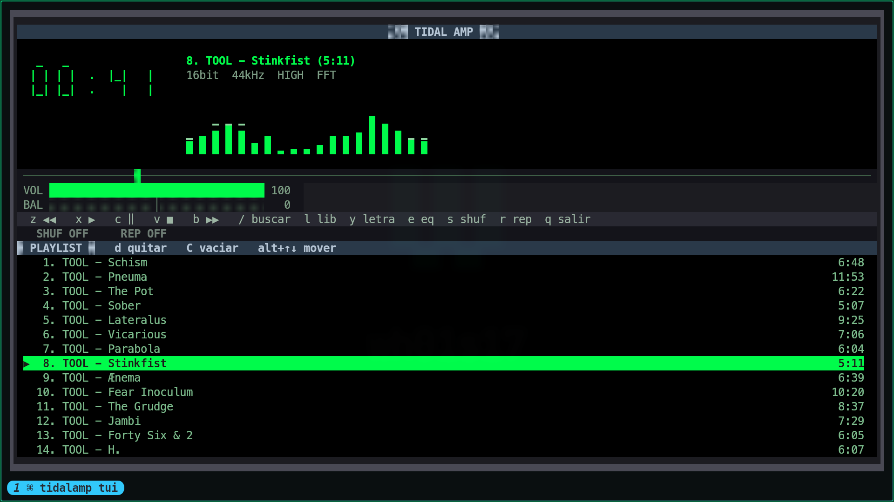

# tidalamp

Un cliente de TIDAL para terminal con la estética de Winamp 2.x. Sin registrar apps
en la API oficial y sin navegador de por medio: device flow + mpv.



## Cómo funciona

Tres capas independientes:

| Capa | Qué hace | Módulo |
|---|---|---|
| Auth | Device flow de TIDAL, sin registrar ninguna app | `auth.py` |
| Stream | Resuelve una pista a algo que mpv pueda abrir | `stream.py` |
| Playback | Un `mpv --idle` de larga vida controlado por socket IPC | `player.py` |
| UI | TUI en Textual con la estética de Winamp | `app.py`, `widgets.py` |
| Cola | Orden, shuffle, repeat y persistencia | `queue.py` |
| Biblioteca | Playlists, favoritos, álbumes y artistas | `library.py` |
| MPRIS | Servicio D-Bus para el resto del escritorio | `mpris.py` |
| Red | Reintentos con backoff sobre las llamadas a TIDAL | `net.py` |
| Espectro | cava contra el sink, cuando está instalado | `spectrum.py` |
| Audio | Balance y ecualizador como filtros de mpv | `settings.py` |
| Letras | Carga, parseo LRC y fallback a texto plano | `lyrics.py` |

**Autenticación**: no usa la API oficial de `developer.tidal.com` (que exige registrar
una app y ni siquiera entrega URLs de stream). Usa el mismo *device authorization
flow* que los clientes oficiales de TV/escritorio, vía `tidalapi`. Abres un enlace una
vez, autorizas, y la sesión refrescable queda en `~/.config/tidalamp/session.json`.

**Streaming**: TIDAL devuelve dos formas de manifiesto. `BTS` es una lista de URLs
progresivas que mpv abre directamente. `MPD` es DASH segmentado (típico en
LOSSLESS / HI_RES); `tidalapi` ya parsea los segmentos, así que los volcamos como una
playlist HLS local y le pasamos ese fichero a mpv.

## Integración con el escritorio (MPRIS)

Al arrancar, `tidalamp` publica `org.mpris.MediaPlayer2.tidalamp` en el bus de sesión.
Eso lo hace visible para todo lo que hable MPRIS, sin configuración adicional:

```sh
playerctl -p tidalamp play-pause
playerctl -p tidalamp metadata
```

Con ello funcionan las teclas multimedia de Hyprland, el módulo `mpris` de Waybar
(que además muestra la carátula, porque exportamos `mpris:artUrl`), y cualquier widget
externo — un frontend en Quickshell lo consume con `Quickshell.Services.Mpris` sin
necesidad de IPC propio.

Se exportan `PlaybackStatus`, `Metadata`, `Position`, `Volume`, `LoopStatus`, `Shuffle`
y las capacidades, y se emite `PropertiesChanged` sólo cuando algo cambia de verdad.
Si ya hay otro `tidalamp` en el bus, la segunda instancia se registra como
`org.mpris.MediaPlayer2.tidalamp.instance<pid>` en lugar de quedarse muda. Si no hay bus de sesión,
la aplicación arranca igual y lo indica en la barra de estado.

Nota: lanzamos mpv con `--load-scripts=no` a propósito. Si tienes `mpv-mpris` instalado
en el sistema, sin esa opción mpv publicaría un segundo reproductor duplicado en el bus.

## Cola y biblioteca

`l` abre el navegador de tu biblioteca: playlists, pistas favoritas, álbumes y
artistas. Se navega hacia dentro con `↵` y hacia fuera con `⌫`.

- `↵` sobre una pista la reproduce **y encola el nivel entero**, así que el resto del
  álbum o de la playlist sigue sonando detrás.
- `a` añade al final de la cola sin tocar lo que suena. Sobre una playlist o un álbum
  añade todo su contenido.
- `A` añade todas las pistas del nivel actual.

La cola se guarda en `~/.local/state/tidalamp/queue.json` y se restaura al arrancar,
con el cursor donde lo dejaste. Sólo se guardan los metadatos: el objeto `Track` de la
API se pide al reproducir, así que restaurar una cola larga es instantáneo.

Los niveles largos se paginan de 100 en 100: cuando una página llega llena, la última
fila es `más…` y `↵` sobre ella carga la siguiente **en el mismo nivel**, sin perder la
posición del cursor. Así una playlist de 500 pistas es alcanzable sin descargarla
entera al abrirla.

`alt+↑` y `alt+↓` mueven la pista seleccionada dentro de la cola. Con shuffle activo el
orden de reproducción se remapea en lugar de regenerarse: mover una fila no vuelve a
barajar lo que sonará después.

`s` alterna shuffle y `r` cicla el modo de repetición (ninguna → cola → pista). El
estado queda siempre visible en una franja propia: `SHUF ON/OFF` y
`REP OFF/ALL/1`. Los modos activos se iluminan en verde y ambos se exponen por MPRIS
como `Shuffle` y `LoopStatus`.

## Limitación importante: DRM

Las pistas cuyo manifiesto viene cifrado (Widevine) **no se pueden reproducir con
mpv** — no hay CDM que las descifre. El cliente lo detecta y te lo dice en la barra de
estado en vez de fallar con un error de códec. Si te topas con muchas, baja la calidad:

```sh
TIDALAMP_QUALITY=HIGH tidalamp tui
```

Los valores válidos son `LOW`, `HIGH`, `LOSSLESS` y `HI_RES_LOSSLESS`.

## Instalación

Requiere `mpv` y Python 3.11+.

```sh
python -m venv .venv && .venv/bin/pip install -e .
.venv/bin/tidalamp login
.venv/bin/tidalamp tui
```

## Teclas

Son las de Winamp, a propósito.

| Tecla | Acción |
|---|---|
| `z` `x` `c` `v` `b` | anterior / play / pausa / stop / siguiente |
| `/` | buscar en TIDAL |
| `↑` `↓` `Enter` | navegar y reproducir |
| `l` | navegador de biblioteca |
| `y` | letra de la pista actual |
| `s` `r` | shuffle / repeat |
| `d` | quitar de la cola |
| `alt+↑` `alt+↓` | mover la pista en la cola |
| `e` | ventana del ecualizador |
| `,` `.` `\` | balance izquierda / derecha / centro |
| `C` | vaciar la cola |
| `←` `→` | ±5 segundos |
| `+` `-` | volumen |
| `t` | alternar tiempo transcurrido / restante |
| `q` | salir |

## Cuando algo falla

- **mpv se muere**: la app lo detecta en el siguiente tick, lo relanza con el volumen
  que tenías y recarga la pista en curso, en vez de quedarse congelada contra un socket
  muerto.
- **El token caduca a media sesión**: antes de resolver cada pista se comprueba la
  sesión y, si hace falta, se refresca con el refresh token y se vuelve a guardar. Sólo
  se pide `tidalamp login` cuando ya no hay nada que refrescar.
- **La red falla**: las llamadas a TIDAL se reintentan tres veces con backoff ante
  errores de conexión, timeouts, 429 y 5xx. Un 404 o un 401 no se reintentan.

Para depurar, `TIDALAMP_DEBUG=1 tidalamp tui` escribe un registro en
`~/.local/state/tidalamp/tidalamp.log` (la TUI ocupa el terminal, así que no hay dónde
imprimir). Ahí queda anotado, entre otras cosas, qué rama de manifiesto — `BTS` o
`MPD` — se usó en cada pista.

## Letras

`y` abre la letra de la pista actual sin detener la reproducción. Si TIDAL entrega
subtítulos LRC, la línea activa se resalta y la ventana avanza con la posición de mpv;
si sólo hay texto, se puede desplazar con `↑`, `↓`, `PageUp` y `PageDown`. La consulta
se hace en un worker para no bloquear la TUI, aplica la misma política de reintentos
que el resto del catálogo y se conserva en memoria durante la sesión.

No todas las pistas tienen letras ni todas las licencias regionales las exponen. En
ese caso la ventana muestra un error y la reproducción continúa normalmente.

## Tests

```sh
.venv/bin/python -m pip install -e ".[dev]"
.venv/bin/python -m pytest
```

No tocan la red ni TIDAL: las sesiones y los manifiestos son dobles, y `player.py` se
prueba contra un mpv falso (`tests/fake_mpv.py`) que habla el mismo IPC JSON — eventos
asíncronos incluidos, que es justo la parte del protocolo que da problemas. El parser
de letras se prueba con LRC fijado y texto plano, incluidas las caídas transitorias.

## Ecualizador y balance

`e` abre el ecualizador: diez bandas (60 Hz … 16 kHz, las de Winamp) de ±12 dB, con
`←→` para elegir banda, `↑↓` para moverla y `0` para dejarla plana. Los cambios se
aplican mientras los mueves; un ecualizador que no se oye hasta pulsar «aceptar» no
sirve de nada.

`,` y `.` mueven el balance y `\` lo centra, también desde la ventana principal.

Por debajo, ambos son filtros de mpv: el balance es un `pan` y cada banda no plana es
un `equalizer` encadenado. Una banda a 0 dB no se añade al grafo, y con todo neutro no
hay filtro ninguno — la cadena sólo se reconstruye cuando de verdad hace falta. Ambos
ajustes se guardan en `~/.local/state/tidalamp/settings.json` y se reaplican al
arrancar y después de un reinicio de mpv.

## Sobre el analizador

Hay dos modos, y la insignia junto a la calidad dice cuál está activo:

- **`FFT`** — con [cava](https://github.com/karlstav/cava) instalado, `tidalamp` lo
  lanza contra el sink de audio y dibuja el espectro que mide. Es una FFT de verdad.
- **`RMS`** — sin cava, mpv sólo expone niveles por el filtro `astats`, así que el
  analizador es un vúmetro repartido en bandas con balística de ataque rápido y caída
  lenta. Reacciona a la música, pero no es un desglose por frecuencias, y la insignia
  lo dice en vez de fingir lo contrario.

`pacman -S cava` basta; no hay que configurar nada. Si cava falta, muere o no puede
abrir el sink, se vuelve al vúmetro sin interrumpir la reproducción.

Un matiz honesto: cava escucha el **sink**, no nuestro proceso mpv. Muestra lo que
suene en la máquina, que casi siempre es sólo nosotros.

## Licencia

GPL-3.0-or-later. El texto completo está en [LICENSE](LICENSE).

En corto: puedes usarlo, estudiarlo, modificarlo y redistribuirlo; si distribuyes una
versión modificada, tienes que publicar también su código bajo la misma licencia. Se
distribuye sin garantía de ningún tipo.

La elección no es casual: esto es una aplicación de usuario final que vive en un
ecosistema copyleft (mpv es GPL, `tidalapi` es LGPL-3.0-or-later), y la GPL mantiene
libre cualquier versión que alguien reparta.

## Descargo

`tidalamp` es un proyecto independiente. **No está afiliado, patrocinado ni respaldado
por TIDAL, Aspiro, Square, ni por los titulares de la marca Winamp.** Los nombres se
usan sólo de forma descriptiva, para decir con qué habla el programa y a qué se parece.

- Necesitas **tu propia suscripción de TIDAL**. Esto no da acceso a nada que tu cuenta
  no tenga ya.
- **No elude ninguna protección técnica.** Las pistas con manifiesto cifrado (Widevine)
  se rechazan con un mensaje, no se intentan descifrar. Esa línea es deliberada y no se
  va a cruzar: los parches que añadan descifrado o descarga a fichero no se aceptan.
- **No descarga ni redistribuye música.** Se reproduce en streaming; lo único que toca
  el disco es una playlist HLS temporal, que contiene URLs, no audio.
- Se apoya en el flujo de autorización de dispositivo vía `tidalapi`, no en la API para
  desarrolladores. Usar un cliente no oficial puede ir contra las condiciones de
  servicio de TIDAL; quien lo ejecuta asume esa decisión y el riesgo sobre su cuenta.

La licencia cubre este código. No es, ni puede ser, un permiso de TIDAL.
