# tidalamp

A terminal TIDAL client for Linux with a Winamp 2.x look. No official API app registration
and no browser in the middle: device flow + mpv.


## Hi-res, all the way to the DAC

tidalamp asks TIDAL for `HI_RES_LOSSLESS` by default and plays FLAC up to
**24-bit / 192 kHz**, with the bit depth and sample rate of the running stream on
screen. When TIDAL delivers less than was asked for, the status bar says so instead of
leaving the badge to imply otherwise.

Three things had to be right for that, and two of them are not in the player:

- **The stream.** Hi-res arrives as a segmented DASH manifest, which needs rewriting
  before ffmpeg will open it.
- **The graph.** PipeWire runs at one sample rate and resamples everything into it, so
  a 24/96 stream commonly reaches the DAC at 48 kHz while every badge tells the truth
  about the stream. The settings window detects this, says so plainly, and fixes it —
  see [The audio stack](#the-audio-stack).
- **The chain.** No software volume attenuation and no filters: with the balance
  centred and the equalizer flat, mpv carries `astats` alone, which measures and does
  not touch the signal.

Bluetooth cannot carry any of this, whatever the rates say, and the settings window
warns when the output is a Bluetooth sink.

## Contents

- [Hi-res, all the way to the DAC](#hi-res-all-the-way-to-the-dac)
- [How it works](#how-it-works)
- [Desktop integration (MPRIS)](#desktop-integration-mpris)
- [Queue and library](#queue-and-library)
- [Quality](#quality)
  - [Important limitation: DRM](#important-limitation-drm)
- [Themes and colours](#themes-and-colours)
- [Platform support](#platform-support)
- [Installation](#installation)
    - [Arch Linux (AUR)](#arch-linux-aur)
    - [Other Linux distributions (PyPI)](#other-linux-distributions-pypi)
    - [From the repository](#from-the-repository)
    - [Minimum size](#minimum-size)
- [Configuration](#configuration)
    - [Language](#language)
- [Keys](#keys)
- [The track menu](#the-track-menu)
- [Settings](#settings)
  - [The audio stack](#the-audio-stack)
- [Help and about](#help-and-about)
- [While something is loading](#while-something-is-loading)
- [When something fails](#when-something-fails)
- [Lyrics](#lyrics)
- [Equalizer and balance](#equalizer-and-balance)
- [About the analyzer](#about-the-analyzer)
- [Cover art](#cover-art)
- [License](#license)
- [Disclaimer](#disclaimer)

## How it works

**Search:** `/` searches for tracks and displays them directly, with albums, artists,
and playlists in three category rows above. A category is fetched only when opened,
so the initial search still costs a single request.

**Authentication:** tidalamp does not use the official `developer.tidal.com` API,
which requires app registration and does not provide stream URLs. Instead, `tidalapi`
drives the same device authorization flow used by official TV and desktop clients.
Open a link once, authorize access, and the refreshable session is stored at
`~/.config/tidalamp/session.json`.

**Streaming:** TIDAL returns two kinds of manifest. `BTS` contains progressive URLs
that mpv opens directly. `MPD` is segmented DASH, used for hi-res audio; `tidalapi`
already parses the segments, so tidalamp writes them to a local HLS playlist and
passes that file to mpv.

## Desktop integration (MPRIS)

On startup, tidalamp publishes `org.mpris.MediaPlayer2.tidalamp` on the session bus.
Anything that speaks MPRIS can see it without extra configuration:

```sh
playerctl -p tidalamp play-pause
playerctl -p tidalamp metadata
```

This supports Hyprland media keys, Waybar's `mpris` module (including cover art through
`mpris:artUrl`), and external widgets. A Quickshell frontend, for example, can consume
it through `Quickshell.Services.Mpris` without a separate IPC protocol.

The service exports `PlaybackStatus`, `Metadata`, `Position`, `Volume`, `LoopStatus`,
`Shuffle`, and the capability properties. It emits `PropertiesChanged` only when a
value actually changes.

The complete queue is also published as `org.mpris.MediaPlayer2.TrackList`. `Tracks`
returns row identifiers in visible order, `GetTracksMetadata` resolves them, and
`GoTo` jumps to any row. Each row has its own identifier rather than reusing the TIDAL
track ID: the same song may appear twice, and MPRIS requires distinct IDs. These IDs
also survive queue reordering. `CanEditTracks` is deliberately `False`; `AddTrack`
takes a URI and tidalamp does not advertise any playable URI scheme, so `True` would
promise a feature it cannot provide. Queue changes use `TrackListReplaced`, the signal
required by the specification for this case.

If another tidalamp process already owns the base bus name, the second instance uses
`org.mpris.MediaPlayer2.tidalamp.instance<pid>`. If there is no session bus, playback
still starts and the status bar reports that MPRIS is unavailable.

The package installs `tidalamp.desktop` and its icon as well. This is functional
metadata: MPRIS declares `DesktopEntry=tidalamp`, and clients use that file for the
player name and icon. Without it, Waybar and notifications show an anonymous player.

mpv is started with `--load-scripts=no` on purpose. If `mpv-mpris` is installed on the
system, allowing scripts would publish a duplicate player on the bus.

## Queue and library

Press `l` to open the library browser: playlists, favourite tracks, albums, and
artists. Enter a level with `↵` and go back with `⌫`.

- `↵` on a track plays it **and queues the entire level**, so the rest of the album or
  playlist follows it.
- `a` appends an item without interrupting the current track. On a playlist or album,
  it appends all of its contents.
- `A` appends every track in the current level.

A wide enough terminal splits the queue into columns — title, artist, album, year and
duration — instead of running the artist into the title. They are dropped in the order
they can be spared as the window narrows: first the year, then the album and artist
together, ending at `artist - title` on one line with the duration on the right.

The queue is stored at `~/.local/state/tidalamp/queue.json` and restored on startup,
including the previous cursor. Only metadata is saved; the API `Track` object is
resolved when playback starts, so restoring a long queue is immediate.

Long levels are paginated in groups of 100. The final row is `more…`; pressing `↵` on
it loads the next page **into the same level** without losing the cursor position. A
500-track playlist is therefore reachable without fetching it all up front.

Opened levels are cached for the lifetime of the application, so returning to one is
instant. `R` fetches the current level again, which is useful after creating a
playlist on another device.

`alt+↑` and `alt+↓` move the selected track in the queue. With shuffle enabled, the
playback order is remapped instead of regenerated, so moving a row does not reshuffle
what comes next.

`f` adds the selected track, album, artist, or playlist to TIDAL favourites; `F`
removes it. These are separate commands rather than a toggle because the API cannot
answer whether an item is already a favourite. A toggle would have to download the
entire favourites list or guess, and a wrong guess could delete something you wanted.

`s` toggles shuffle and `r` cycles repeat (off → queue → track). Both sit on the
transport row as buttons, lit in the palette's accent while they are on. Every state
is also readable without colour: `⇄○`/`⇄●` for shuffle, and `↻–`/`↻A`/`↻1` for the
three repeat modes — the `retro`, `nova` and `ascii` layouts spell the same states
out as `SHUFFLE ○` and `REPEAT 1`. Both are also exposed through MPRIS as `Shuffle` and
`LoopStatus`.

## Quality

The default requested quality is `HI_RES_LOSSLESS`. Measured against a real account on
2026-09-08:

| Requested         | `HIRES_LOSSLESS` track        | `LOSSLESS`-only track |
| ----------------- | ----------------------------- | --------------------- |
| `LOW`             | BTS, LOW, 96 kbps             | same                  |
| `HIGH`            | BTS, HIGH, 320 kbps           | same                  |
| `LOSSLESS`        | BTS, **HIGH**                 | BTS, **HIGH**         |
| `HI_RES_LOSSLESS` | **MPD**, FLAC 24-bit / 96 kHz | BTS, HIGH             |

In other words, **requesting `LOSSLESS` never produced lossless audio** through the
device-flow client: TIDAL returned `HIGH` even for tracks it labels `LOSSLESS`.
Requesting `HI_RES_LOSSLESS` yields FLAC where available and `HIGH` otherwise, so it is
strictly better than the old default.

When TIDAL delivers less than requested, the status bar says so (`TIDAL delivered
HIGH, not HI_RES_LOSSLESS`) instead of leaving the badge to imply it.

```sh
TIDALAMP_QUALITY=HIGH tidalamp tui
```

Valid values are `LOW`, `HIGH`, `LOSSLESS`, and `HI_RES_LOSSLESS`.

## Important limitation: DRM

Tracks with encrypted Widevine manifests **cannot be played by mpv** because there is
no CDM to decrypt them. tidalamp detects this and reports it in the status bar instead
of failing with a codec error. If it happens frequently, lower the quality with
`TIDALAMP_QUALITY=HIGH` (see [Quality](#quality)).

## Themes and colours

Two independent settings. `theme` picks the **layout** — how the interface is drawn.
`palette` picks the **colours** it is drawn in. Any layout works with any palette, and
both can be changed from the settings window (`o`) without restarting playback.

| `theme`   | Look                                                                                                                                                                                                   |
| --------- | ------------------------------------------------------------------------------------------------------------------------------------------------------------------------------------------------------ |
| `quattro` | The default. Flat, modern, short dividers, left-aligned headings.                                                                                                                                      |
| `retro`   | The 1997 skin as far as a terminal goes: title bars drawn as a rule with the heading centred on it, square transport keys packed shoulder to shoulder, and the toggles spelled `SHUFFLE` and `REPEAT`. |
| `nova`    | Frameless. One flat ground, no boxes anywhere, and colour reserved for the two controls that carry state — an accent rule under whichever toggle is on.                                                |
| `ascii`   | A terminal before it had box drawing: `[ z << ]` bracket keys, rules made of `=` and `-`, and no glyph in the chrome you could not type. The meters keep their block characters.                       |

<table>
  <tr>
    <td width="50%">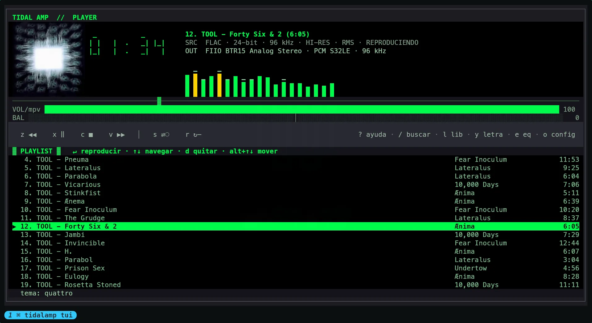</td>
    <td width="50%">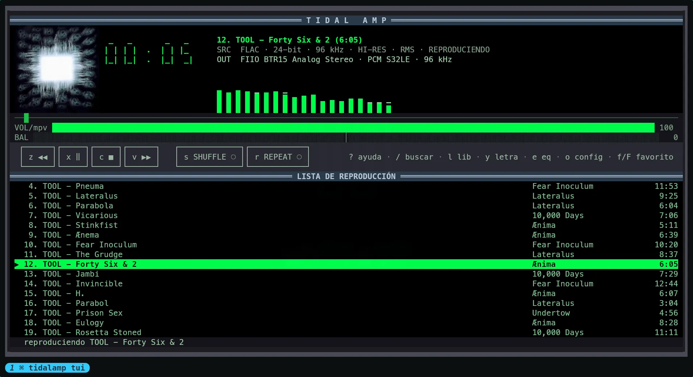</td>
  </tr>
  <tr>
    <td align="center"><code>theme = "quattro"</code></td>
    <td align="center"><code>theme = "retro"</code></td>
  </tr>
  <tr>
    <td width="50%">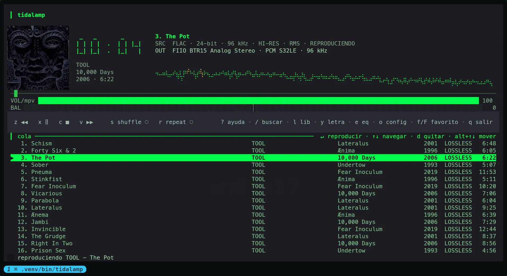</td>
    <td width="50%">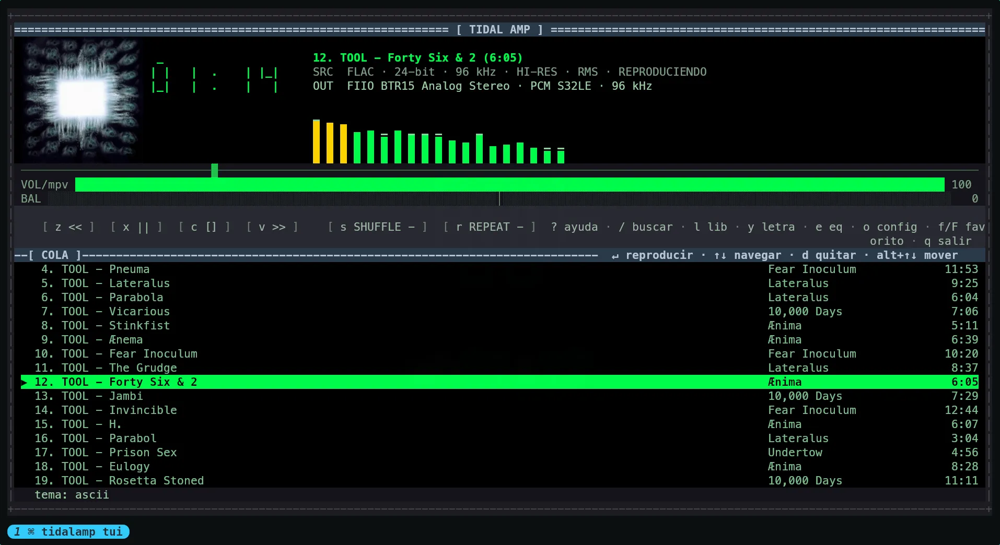</td>
  </tr>
  <tr>
    <td align="center"><code>theme = "nova"</code></td>
    <td align="center"><code>theme = "ascii"</code></td>
  </tr>
</table>

`palette` accepts `auto` (follow Omarchy), `classic` (the original green-on-black
Winamp colours), the built-ins `tokyo-night`, `catppuccin`, `nord` and `gruvbox`, or
the name of a TOML file you drop in `~/.config/tidalamp/palettes/`. Custom palettes use
the same format as Omarchy's `colors.toml`, so the built-ins and your own work on any
Linux, with or without Omarchy.

The same layout, repainted. Five of these are Omarchy themes picked up through `auto`;
the first is the player's own `classic`, which is what you get anywhere else.

<table>
  <tr>
    <td width="33%">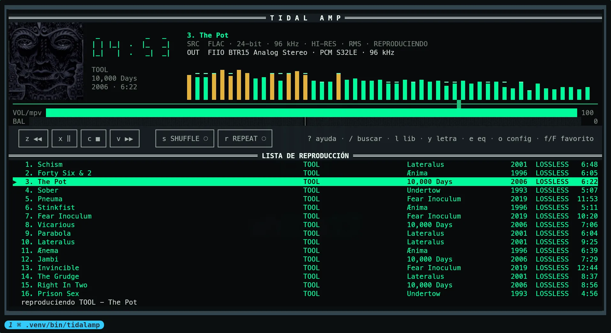</td>
    <td width="33%">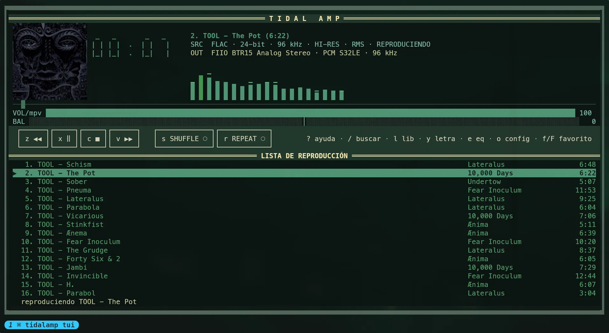</td>
    <td width="33%">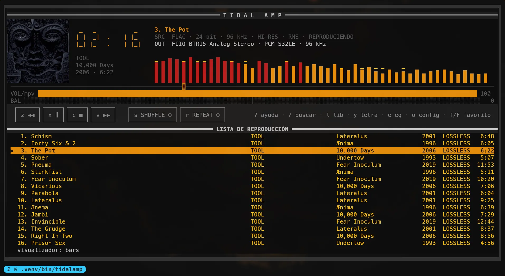</td>
  </tr>
  <tr>
    <td width="33%">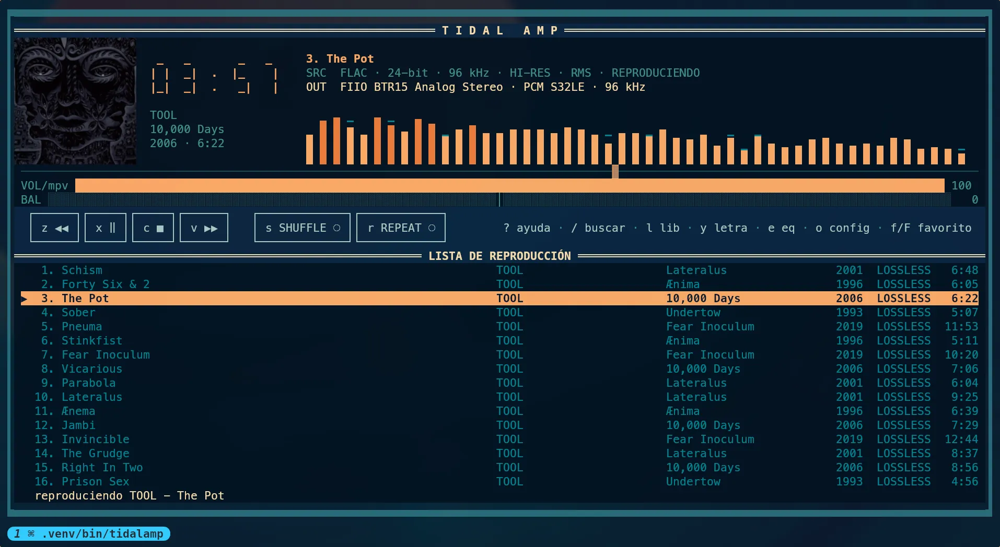</td>
    <td width="33%">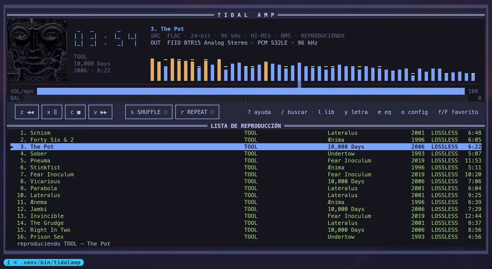</td>
    <td width="33%">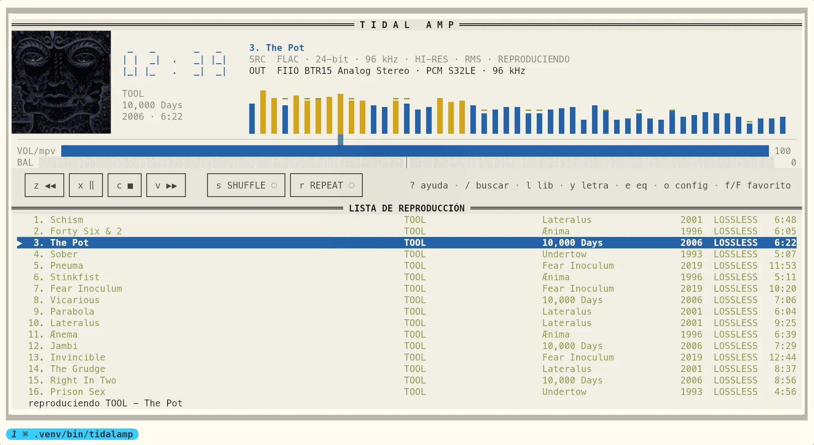</td>
  </tr>
</table>

Nothing above is a separate stylesheet: it is one layout reading the colours it was
given, which is why a palette you write yourself gets the same treatment as the ones
that ship.

On Omarchy, tidalamp reads the active palette from
`$XDG_STATE_HOME/omarchy/current/theme/colors.toml` (or
`~/.local/state/omarchy/current/theme/colors.toml`) and applies its backgrounds,
foregrounds, accent, and semantic colours throughout the UI: CSS, lists, clock,
analyzer, sliders, lyrics, and equalizer. Changing the theme while the TUI is open
updates the palette within two seconds without disturbing playback.

On other distributions, or when the file is missing or invalid, tidalamp falls back to
its original green-on-black Winamp palette. The integration only reads Omarchy state;
it does not modify themes or require the `omarchy` command.

## Platform support

tidalamp is a Linux application. Real playback has been tested on Arch Linux with
Omarchy, and the automated test suite runs on Ubuntu. It should work on other desktop
Linux distributions that provide Python 3.11 or newer and `mpv`, although real
playback has not yet been tested on each of them.

| Platform                                                | Status                                                                                            |
| ------------------------------------------------------- | ------------------------------------------------------------------------------------------------- |
| Arch Linux / Omarchy                                    | Supported and tested; the AUR is the recommended installation channel                             |
| Debian / Ubuntu                                         | Supported through PyPI; the automated suite runs on Ubuntu                                        |
| Fedora, openSUSE, and other desktop Linux distributions | Expected to work through PyPI, but not yet tested with real playback                              |
| WSL2                                                    | Best effort; audio must be configured separately and desktop integration may be unavailable       |
| macOS                                                   | Unsupported and untested; the core may run, but the Linux desktop and audio integrations will not |
| Windows                                                 | Not compatible: mpv is controlled through a Unix socket and desktop integration uses D-Bus/MPRIS  |
| BSD and Android/Termux                                  | Unsupported and untested                                                                          |

A missing D-Bus session only disables MPRIS and desktop media controls; it does not
stop playback. Cover art also falls back to terminal blocks when kitty graphics and
sixel are unavailable.

## Installation

**pip does not install `mpv`.** It must be present on the system; without it, tidalamp
exits on startup with `MpvNotFound`. Python 3.11 or newer is also required. Install
`cava` if you want a real spectrum instead of the RMS meter.

### Arch Linux (AUR)

```sh
yay -S tidalamp        # installs mpv and the other dependencies
```

This is the recommended channel on Arch because it can declare `mpv` as a real
dependency and `cava` as optional.

### Other Linux distributions (PyPI)

```sh
sudo apt install mpv          # or the equivalent for your distribution
pipx install "tidalamp[art]"  # the art extra adds Pillow for cover rendering
```

### From the repository

```sh
python -m venv .venv
.venv/bin/pip install -e ".[art]"   # drop [art] only if you do not want cover art
.venv/bin/tidalamp login
.venv/bin/tidalamp tui
```

Without the `art` extra (Pillow) everything works except the cover, which is simply
not drawn; tidalamp says so once in the status line at startup.

The complete release process for PyPI, GitHub Releases, and the AUR is documented in
[`publish.md`](publish.md). Packaging-specific notes are kept in
[`packaging/README.md`](packaging/README.md).

### Minimum size

The interface needs **76×20** cells. Below that size the fixed layout would overlap,
so tidalamp covers it with a message showing the current and required dimensions.
The normal interface returns automatically when the terminal is enlarged.

## Configuration

Everything is optional, and everything can be set from inside the player: `o` opens
the [settings window](#settings), which writes the file for you. `tidalamp config`
shows the effective settings and creates `~/.config/tidalamp/config.toml` if it does
not exist:

```toml
quality = "HI_RES_LOSSLESS"   # LOW, HIGH, LOSSLESS, or HI_RES_LOSSLESS
artwork = "auto"              # auto, kitty, sixel, blocks, or off
language = "auto"             # auto follows the locale; es or en pin it
theme = "quattro"             # layout: quattro, retro, nova, or ascii
palette = "auto"              # colours: auto, classic, a built-in, or your own
debug = false                 # log to ~/.local/state/tidalamp/tidalamp.log

[keys]
play = "p"
quit = "ctrl+q"
```

Precedence is **environment → file → default**. `TIDALAMP_QUALITY`, `TIDALAMP_ART`,
`TIDALAMP_LANG`, `TIDALAMP_THEME`, `TIDALAMP_PALETTE`, and `TIDALAMP_DEBUG` therefore
override the file for one-off runs;
the settings window labels a row whose value is being shadowed that way, rather than
showing a value the app is not using. A syntax error in the file does not prevent
startup; it is logged and the defaults take over.

Settings written from the window keep the file's comments: it edits the line in place
instead of dumping the settings back through a parser.

Under `[keys]`, the action is on the left and the key on the right; separate multiple
keys with commas. Valid actions are listed in the table below, and `tidalamp config`
warns about unknown ones. **Navigation keys are fixed**—arrows, Page Up/Down, Enter,
and Esc—because a typo there could make the browser unusable.

### Language

English and Spanish are built in; Spanish is the source language and the fallback for
unsupported or neutral locales.

The `language` setting decides, and `auto` hands the decision to the locale. The
setting comes first on purpose: `$LANG` is ambient rather than chosen, and a system in
Spanish is not a request for this program to be in Spanish.

```toml
language = "en"   # auto, es, or en
```

With `auto`, the standard `LANGUAGE`, `LC_ALL`, `LC_MESSAGES`, and `LANG` variables are
consulted in that order. To override for one run:

```sh
LANGUAGE=es tidalamp tui
TIDALAMP_LANG=en tidalamp tui
```

No gettext catalogue or compiled locale files are required; translations ship inside
the pure-Python wheel.

## Keys

The defaults follow Winamp, with one deliberate departure: Winamp spent `c` on a
separate pause, and here play and pause share one button, so the transport is four
adjacent keys in the order the buttons appear. All of them may be changed as described
above, and the buttons then show the key that actually works.

| Key             | Action                                             |
| --------------- | -------------------------------------------------- |
| `z` `x` `c` `v` | previous / play-pause / stop / next                |
| `/`             | search TIDAL                                       |
| `↑` `↓` `Enter` | navigate; on a track, open the track menu          |
| `l`             | open the library browser                           |
| `f` `F`         | add to / remove from favourites                    |
| `R`             | reload the level, bypassing the cache              |
| `y`             | show lyrics for the current track                  |
| `s` `r`         | shuffle (`⇄`) / repeat (`↻`), on the transport row |
| `d`             | remove from the queue                              |
| `alt+↑` `alt+↓` | move the track in the queue                        |
| `e`             | open the equalizer                                 |
| `,` `.` `\`     | balance left / right / centre                      |
| `C`             | clear the queue                                    |
| `←` `→`         | seek ±5 seconds                                    |
| `+` `-`         | change volume                                      |
| `t`             | toggle elapsed / remaining time                    |
| `o`             | open the settings window                           |
| `?` `h`         | open the help window                               |
| `q`             | quit                                               |

## The track menu

`↵` on a song—in search results or in the library—opens a small menu instead of
assuming what you meant:

|     | Action            | Key | What it does                                                                                                                                                                              |
| --- | ----------------- | --- | ----------------------------------------------------------------------------------------------------------------------------------------------------------------------------------------- |
| `▶` | Play now          | `a` | Queues the whole level and starts on this track, which is what `↵` used to do on its own.                                                                                                 |
| `↳` | Play next         | `c` | Inserts just this track after the one playing. Under shuffle it really is next, not next in the list.                                                                                     |
| `≈` | Track radio       | `d` | Plays TIDAL's station for this track: the seed first, then the songs TIDAL considers similar. TIDAL heads its own station with the seed, which is filtered out so it is not queued twice. |
| `♥` | Add to favourites | `v` | Adds it to your TIDAL favourites, leaving the queue alone.                                                                                                                                |

`↑` `↓` and `↵` pick, `Esc` backs out. `↵` on an album, artist or playlist still
opens it: a level has one obvious thing to do.

Not every track has a radio station—TIDAL simply has none for some obscure
releases—and when it does not, the status line says so and nothing is queued.

## Settings

`o` opens a settings window — the transport bar lists it, next to `? help`. Every row writes `~/.config/tidalamp/config.toml`,
so a change made once stays made — until now these could only be reached by
editing that file, or by exporting a variable before launching.

| Setting   | Values                                    | Takes effect   |
| --------- | ----------------------------------------- | -------------- |
| Quality   | `LOW` `HIGH` `LOSSLESS` `HI_RES_LOSSLESS` | the next track |
| Cover art | `auto` `kitty` `sixel` `blocks` `off`     | on restart     |
| Language  | `auto` `es` `en`                          | on restart     |
| Debug log | on / off                                  | immediately    |

An environment variable still wins over the file, and the row says so rather
than showing a value the app is not using.

### The audio stack

The same window shows what is underneath mpv, because nothing else can:

```
  Hi-res rates in PipeWire   not configured
                               the graph is stuck at 48000 Hz and resamples…
  Restart PipeWire           action

  Output: Your USB DAC Analog Stereo · 48000 Hz s32le
```

PipeWire runs its graph at one sample rate and resamples everything into it.
By default that is often a single allowed rate, so a 24/96 stream reaches the
DAC at 48 kHz: the badge in the player is telling the truth about the stream,
and the DAC still never sees hi-res. **Hi-res rates in PipeWire** drops a file
into `~/.config/pipewire/pipewire.conf.d/` that lets the graph follow the
stream, and **Restart PipeWire** applies it — stopping playback first, since
mpv is holding the sink.

The window also names the output and warns when it is Bluetooth, which cannot
carry lossless whatever the rates say. Both actions are reversible: the row
toggles the file back off, and deleting it by hand does the same.

## Help and about

`?` (or `h`) opens a window listing every key with what it does, grouped by
what you are doing: playback, volume, the queue, the windows, favourites, and
the keys that only apply inside search and the library.

It reads the bindings from the running app, not from a hardcoded list, so a key
rebound in `config.toml` shows up there as the key you actually have to press.

The same window carries the _About_ section — version, author, repository,
licence — and a summary of what each released version brought. Those notes live
in `tidalamp/about.py` rather than being parsed out of `CHANGELOG.md`, which is
not shipped inside the wheel.

`↑` `↓` scroll, `PgUp` `PgDn` a page, `Home` `End` jump to either end, and
`?`, `h` or `Esc` close it.

## While something is loading

Every slow operation—opening the library, entering a playlist, requesting another
page, resolving a track, or fetching lyrics—runs in a worker thread so the interface
remains responsive. Because a wait could otherwise look like a hang, an animated
spinner says **what** is pending, for example `⠋ opening My playlist…`, in either the
browser title bar or the main status bar.

The level title is never replaced with “loading”; it is the only label that says where
you are. Going back while a level is loading stops its spinner because the eventual
result belongs to a level you have already left.

## When something fails

- **mpv dies:** the next tick detects it, starts a fresh process with the previous
  volume, and reloads the current track instead of leaving the UI attached to a dead
  socket.
- **The token expires:** whether at startup or during a session, tidalamp refreshes it.
  On startup, it catches the raw 401 that `tidalapi` lets escape and rebuilds the
  handshake; it checks again before resolving each track. `tidalamp login` is required
  only when there is no usable refresh token.
- **The network fails:** TIDAL calls are retried three times with backoff for connection
  errors, timeouts, 429 responses, and 5xx responses. A 401 or 404 is not retried.

For diagnostics, `TIDALAMP_DEBUG=1 tidalamp tui` writes to
`~/.local/state/tidalamp/tidalamp.log`. The TUI owns the terminal, so logging goes to a
file. Among other details, the log records whether each track used the `BTS` or `MPD`
manifest path.

## Lyrics

`y` opens lyrics for the current track without stopping playback. When TIDAL provides
LRC subtitles, the active line is highlighted and the window follows mpv's position.
Plain text can be scrolled with `↑`, `↓`, `PageUp`, and `PageDown`. The request runs in
a worker, uses the same retry policy as the rest of the catalogue, and is cached in
memory for the session.

Not every track has lyrics, and regional licences do not always expose them. In that
case, the window displays an error and playback continues normally.

## Equalizer and balance

`e` opens a ten-band equalizer (60 Hz … 16 kHz, matching Winamp) with a ±12 dB range.
Use `←→` to select a band, `↑↓` to adjust it, and `0` to flatten it. Changes are applied
while you move them; an equalizer you cannot hear until pressing “OK” is not useful.

`,` and `.` move the balance, and `\` centres it, including from the main window.

Settings are stored in `~/.local/state/tidalamp/settings.json` and reapplied on
startup.

## About the analyzer

The quality display identifies which of two modes is active:

- **`FFT`:** with [cava](https://github.com/karlstav/cava) installed, tidalamp runs it
  against the audio sink and draws the measured spectrum—a real FFT.
- **`RMS`:** without cava, mpv exposes only levels through its `astats` filter. The
  analyzer becomes a band-shaped meter with fast attack and slow decay. It reacts to
  music but is not a frequency breakdown, and the badge says so.

On Arch, `pacman -S cava` is enough; no configuration is needed. If cava is missing,
dies, or cannot open the sink, tidalamp returns to the RMS meter without interrupting
playback.

One honest caveat: cava listens to the **sink**, not specifically to tidalamp's mpv
process. It displays everything playing on the machine, which is usually just
tidalamp.

## Cover art

Album art is drawn to the left of the display, in a box that grows with the terminal
from 18×9 cells up to 40×20. Two ceilings keep it in its place: it takes at most a
quarter of the height, so it cannot eat the playlist, and it leaves room on its row for
the clock and the marquee — a tall but narrow terminal keeps the small box. The
renderer is selected automatically from the terminal's capabilities:

| Protocol       | Terminals                   | Result                        |
| -------------- | --------------------------- | ----------------------------- |
| kitty graphics | kitty, Ghostty, WezTerm     | real pixels                   |
| sixel          | foot, mlterm, contour, yaft | real pixels                   |
| half blocks    | any other terminal          | `▀` with two colours per cell |

Detection reads `$TERM`, `$TERM_PROGRAM`, and `$KITTY_WINDOW_ID`, and falls back to
half blocks, which work reasonably well everywhere. To force a renderer:

```sh
TIDALAMP_ART=blocks tidalamp tui   # kitty | sixel | blocks | off
```

**Pillow** is required to decode images (`pip install pillow` or
`pacman -S python-pillow`). Without it, cover art is omitted and everything else keeps
working—the same treatment as a missing cava—and the status bar says so at startup,
because an empty corner explains nothing on its own. Covers are cached under
`~/.cache/tidalamp/art/`, keyed by URL. TIDAL includes the image ID in the path, so a
URL never changes its content.

## License

GPL-3.0-or-later. See [LICENSE](LICENSE) for the complete text.

In short, you may use, study, modify, and redistribute tidalamp. If you distribute a
modified version, you must also publish its source under the same licence. The program
is provided without warranty of any kind.

## Disclaimer

tidalamp is an independent project. **It is not affiliated with, sponsored by, or
endorsed by TIDAL, Aspiro, Square, or the owners of the Winamp trademark.** Names are
used only descriptively to identify the service it communicates with and the
interface it resembles.

- You need **your own TIDAL subscription**. tidalamp provides no access beyond what
  your account already has.
- tidalamp **does not circumvent technical protection measures**. Tracks with
  encrypted Widevine manifests are rejected with a message; no decryption is
  attempted. This boundary is deliberate, and patches that add decryption or download
  audio to files will not be accepted.
- tidalamp **does not download or redistribute music**. Audio is streamed. The only
  on-disk playback artifact is a temporary HLS playlist containing URLs, not audio.
- Authentication uses TIDAL's device authorization flow through `tidalapi`, not the
  developer API. Using an unofficial client may conflict with TIDAL's terms of
  service; users accept that decision and any risk to their account.

The licence applies to this code. It is not, and cannot be, permission from TIDAL.
